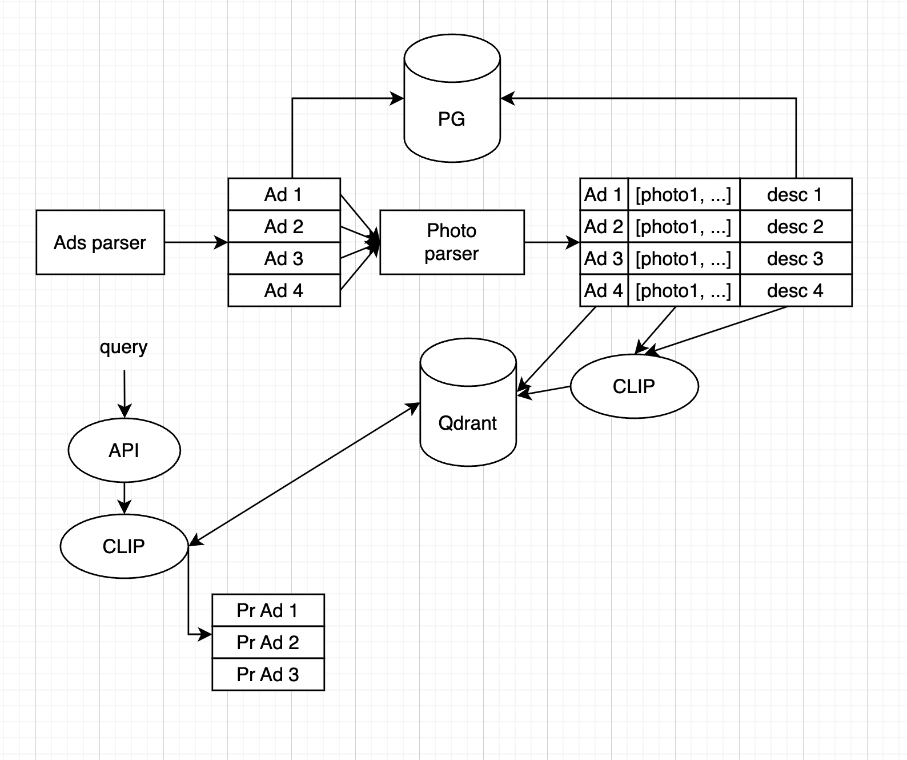
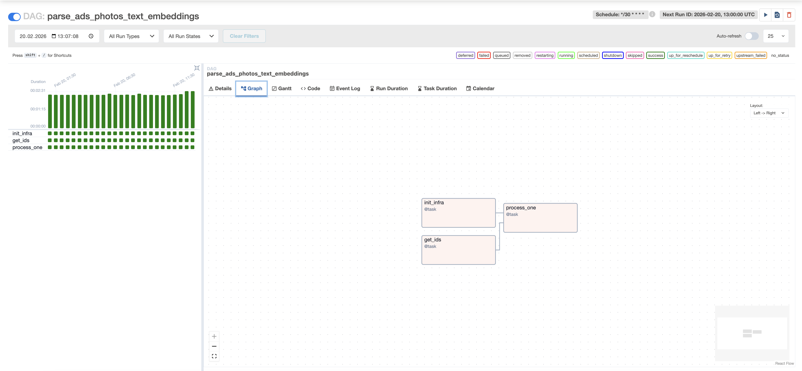
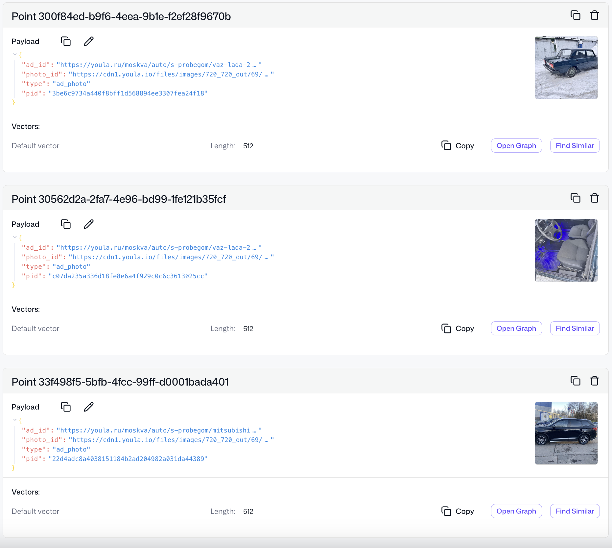

## AVTO-CLIP
--- 
An automatically updated database of used car photos with prices and human descriptions.

### 

- PG (sql) - stores information about advertisements and descriptions
- VDB (Qdrant) - stores compact vectors os photos and descriptions
- S3 Cloud - stores cars' photos

--- 

### Ad Parser

API required for ad parsing, for example - https://github.com/NoNanoMax/youla_parser/tree/main

--- 

### How to run

Set Ad parse API url to enviroments and run:

```
sudo docker compose up --build -d
```

Check:

✅ http://\<ip\>:8080/home - airflow server (login: arflow, password: airflow)

✅ http://\<ip\>/dashboard - qdrant dashboard. After first airflow run you can see the first collected data: 
✅ app db - data base with meta information:
```
sudo docker exec -it app-db -psql -U app
...
SELECT * FROM photos;
SELECT * FROM ads;
```
✅ api - http://\<ip\>:7777/docs

----
#### API

- /search - find top limit cars photos of which are similar to the description
```
{  
    "query": "string",
    "limit": 1
} 
```

- /desc/search - find top limit cars human's descritption of which are similar to the description
```
{  
    "query": "string",
    "limit": 1
} 
```
